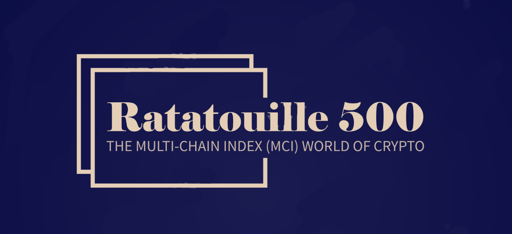

# Ratatouille 500 🧅🍅🍆

### The Multi-Chain Index (MCI) World of Crypto 🌍📈

[](https://ethglobal.com/events/paris2023/)
[](https://github.com/gorgos/Ratatouille500/actions)
[](https://github.com/gorgos/Ratatouille500/issues)
[](https://github.com/gorgos/Ratatouille500/stargazers)
[](https://github.com/gorgos/Ratatouille500/blob/main/LICENSE)

---

<p align="center">
  
</p>

The **Ratatouille500** fund captures the value of top cryptocurrencies and projects across several different
blockchains, aiming to provide a balanced, diversified portfolio in the ever-growing, ever-changing crypto ecosystem.

This project is named after the famous French dish Ratatouille, symbolizing the diverse and rich blend of ingredients,
or in our case, crypto assets from various blockchains.

## ⛓️ Integrated Chains

Our fund integrates with the following chains:

- Ethereum Goerli: `0x478C2D2698F162C55E064C8C3B1f4F9E2Abb1181`
- Filecoin Testnet: <TODO> (deployment failed for unknown reasons)
- Linea Testnet: <TODO> (deployment failed for unknown reasons)
- Polygon ZK Testnet: `0xe089e1B4DFce9f384a91a4a084C5ade14b932761`
- Celo Testnet: `0xCe92006F9C121c2000258224EC6AF5B1Db4c6189`
- zkSync Testnet: <TODO> (deployment failed for unknown reasons)
- Neon EVM Testnet: <TODO> (deployment failed for unknown reasons)
- Mantle Testnet: <TODO> (deployment failed for unknown reasons)
- Gnosis Chain Testnet: `0x9108Ab1bb7D054a3C1Cd62329668536f925397e5`
- Zeta Chain Testnet: <TODO> (deployment failed for unknown reasons)

## 🚀 Features

- To ensure seamless interchain transfers, we utilize Axelar, a cross-chain communication protocol that enables
  decentralized applications to work on any blockchain.
- Chainlink: To ensure reliable, and widely available price feeds.
- Uniswap: An automated liquidity protocol powered by a constant product formula and implemented in a system of
  non-upgradeable smart contracts on the Ethereum blockchain.
- 1inch: A decentralized exchange aggregator that sources liquidity from various exchanges to provide the best trade
  rates.

## ⚙️ Deployment

You can clone the repository, copy and fill out the .env.example and run:

```bash
git clone https://github.com/gorgos/Ratatouille500.git
cd Ratatouille500
pnpm install
forge script script/Deploy.s.sol:DeployMultiChainIndexFund --rpc-url https://goerli.infura.io/v3/${API_KEY_INFURA} --broadcast --verify -vvvv
```

## 🎥 Demo

You can find a demo video here: [TODO](TODO).

## 📚 License

This project is licensed under the MIT License - see the LICENSE file for details.

## 💬 Support

If you find any bugs or have a feature request, please open an issue on Github!.

## 🏆 Acknowledgements

Big thanks to the ETH Global 2023 team for organizing the hackathon where Ratatouille500 was born.
